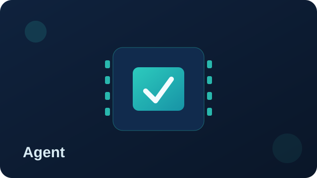

# Telemetry Forge Agent Documentation

{ .product-hero-image }

## What is our Agent?

The Telemetry Forge Agent is an **enterprise-hardened distribution of Fluent Bit**, maintained by core open source software (OSS) maintainers. It delivers production-ready log processing with enhanced security, reduced footprint, and enterprise support.

- [Getting Started](./getting-started.md) - Install and run a minimal pipeline with our agent

### Key Differentiators

- ✅ **70% smaller than OSS Fluent Bit** - Optimised for production deployments
- ✅ **Security-hardened by default** - FORTIFY_SOURCE, stack protection, and reduced attack surface
- ✅ **24-month long-term support (LTS)** - Weekly security patches and critical bug fixes
- ✅ **Enterprise features** - Advanced deduplication, artificial intelligence (AI) filtering, and compliance tools
- ✅ **Fully supported** - Direct access to core Fluent Bit maintainers

### Main features

- [Performant log deduplication at source](./features/record-deduplication.md)
- [Log sampling processor](./features/log-sampling.md)
- [Git configuration auto-reload](./features/git-config-auto-reload.md)
- [AI-based filtering and routing](./features/llm-tagging.md)
- Tail sampling and OpenTelemetry Transformation Language (OTTL)-style logic
- Efficient filesystem storage buffer
- Dedicated integration and regression testing
- Native flattening filtering to prevent field explosion and type mismatches (e.g. in Opensearch or Elasticsearch)

## Documentation

- [Getting Started](./getting-started.md) - Install and run a minimal pipeline with our agent
- [Environment Variables](./features/environment-variables.md) - Runtime variables available in Fluent Bit config interpolation
- [Supported Platforms](./supported-platforms.md) - Verified operating system (OS) and architecture support
- [Version Mapping](./version-mapping.md) - Agent to OSS Fluent Bit version alignment
- [Security](./security.md) - Hardening features and Common Vulnerabilities and Exposures (CVE) management
- [OSS Fluent Bit Docs](https://docs.fluentbit.io) - Core documentation reference

## Enterprise Features

Available directly via [Red Hat catalogue](https://catalog.redhat.com/software/container-stacks/detail/68cfeb03e65464ef8fd4d608).

### Performance & Reliability

- **[Log Deduplication](./features/record-deduplication.md)** - Eliminate duplicate logs at source, reducing costs by up to 40%
- **Efficient Storage Buffer** - Advanced filesystem buffering for reliability
- **Tail Sampling** - Smart sampling with OTTL-style logic for high-volume environments

### Configuration Management

- **[Git Configuration Auto-Reload](./features/git-config-auto-reload.md)** - Automatically reload configuration from Git repositories when changes are detected

### Data Processing

- **[Log sampling processor](./features/log-sampling.md)**
- **AI-Powered Filtering** - Intelligent log routing and filtering
- **Native Field Flattening** - Prevent field explosion in Elasticsearch/OpenSearch
- **Type Safety** - Automatic type conflict resolution

### Enterprise Hardening

- **Reduced Attack Surface** - 17 vendor-specific plugins disabled by default
- **Security by Default** - All remote interfaces disabled, authentication required
- **Compliance Ready** - Federal Information Processing Standards (FIPS)-compliant builds with OpenSSL in FIPS mode

## Build Optimisations

Our Agent is **70% smaller than OSS Fluent Bit** through:

- **Reduced scope** - Only production-essential plugins included
- **Secure defaults** - Vendor-specific and risky plugins disabled
- **Optimised compilation** - Size-focused builds with dead code elimination

[Learn more about build optimisations →](./build-optimisations.md)

## Support & Lifecycle

### Long-Term Support (LTS)

| Component | Timeline | Details |
|-----------|----------|---------|
| **Major Release** | Every 12 months | New features and improvements |
| **Security Updates** | Weekly | CVE patches and critical fixes |
| **Support Window** | 24 months | No breaking changes, full backports |
| **Vulnerability Exploitability eXchange (VEX) Feed** | Continuous | Automated vulnerability reporting |

## Testing & Quality

### Continuous Validation

- **Daily Security Scans** - Core and dependency vulnerability scanning
- **Integration Testing** - Full regression suite for enterprise scenarios
- **Memory Safety** - Valgrind and AddressSanitizer validation
- **Performance Benchmarks** - Continuous performance regression testing

## Resources

### Technical Documentation

- [Build Optimisations](./build-optimisations.md) - Size and performance improvements
- [Security Hardening](./security.md) - Comprehensive security features
- [Feature Documentation](./features/index.md) - Enterprise feature guides

### Contact

For custom builds, white-label solutions, or enterprise support: **<info@telemetryforge.io>**

