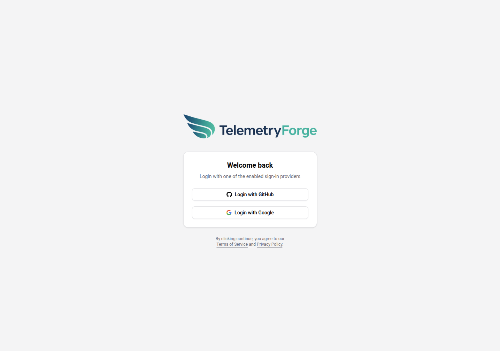
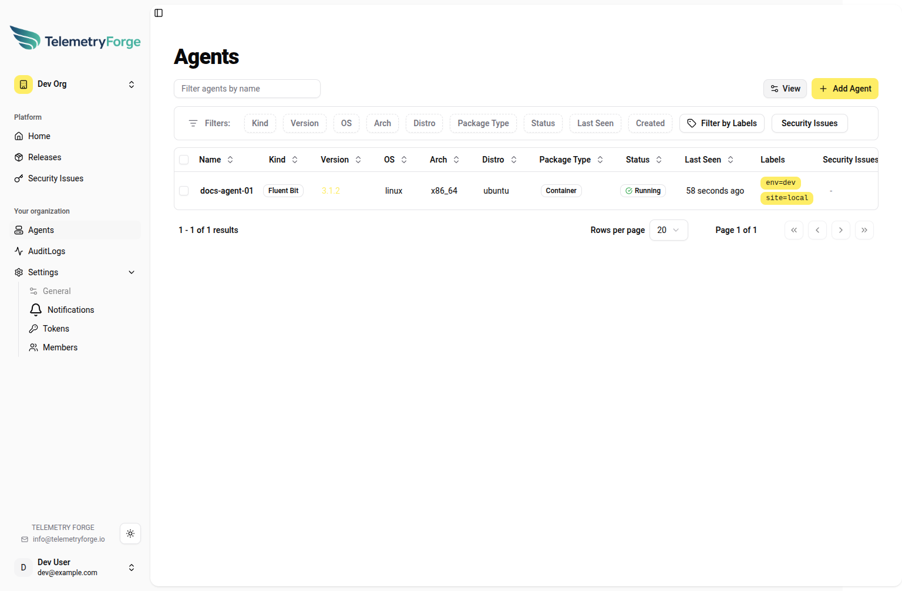
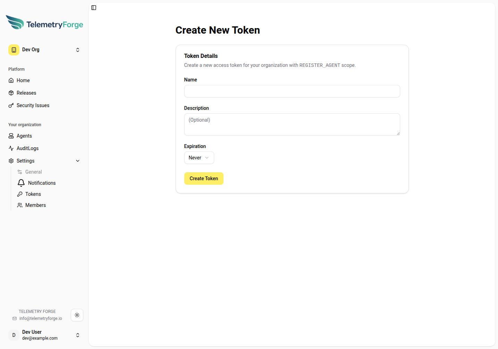
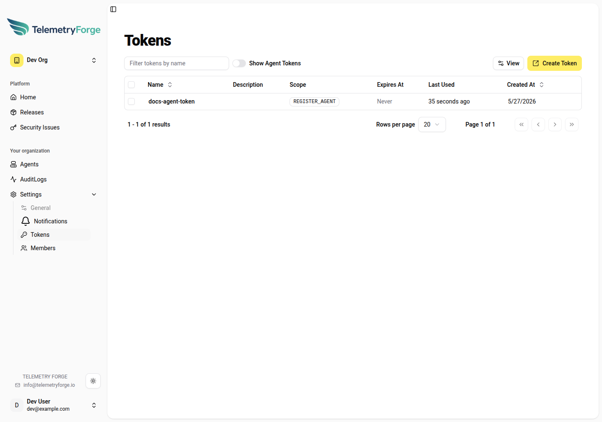
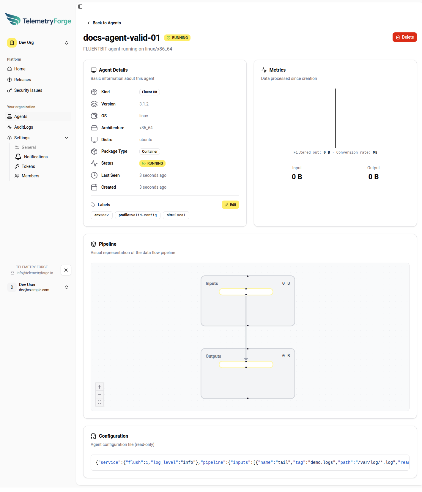
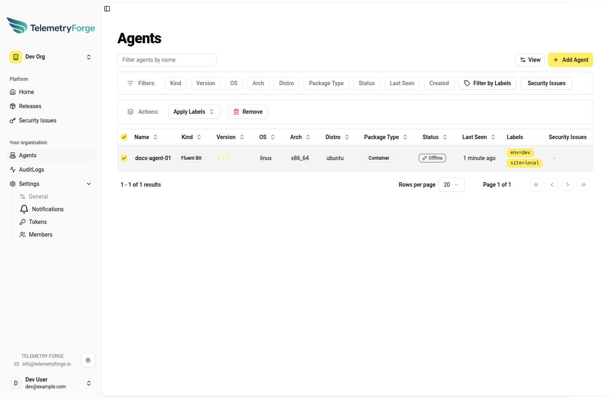
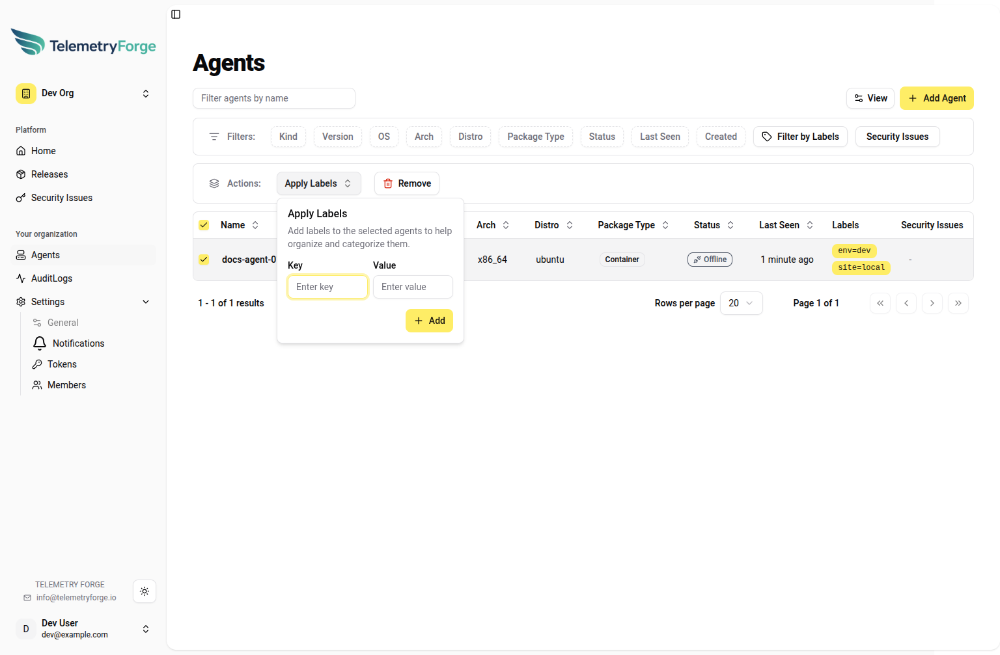
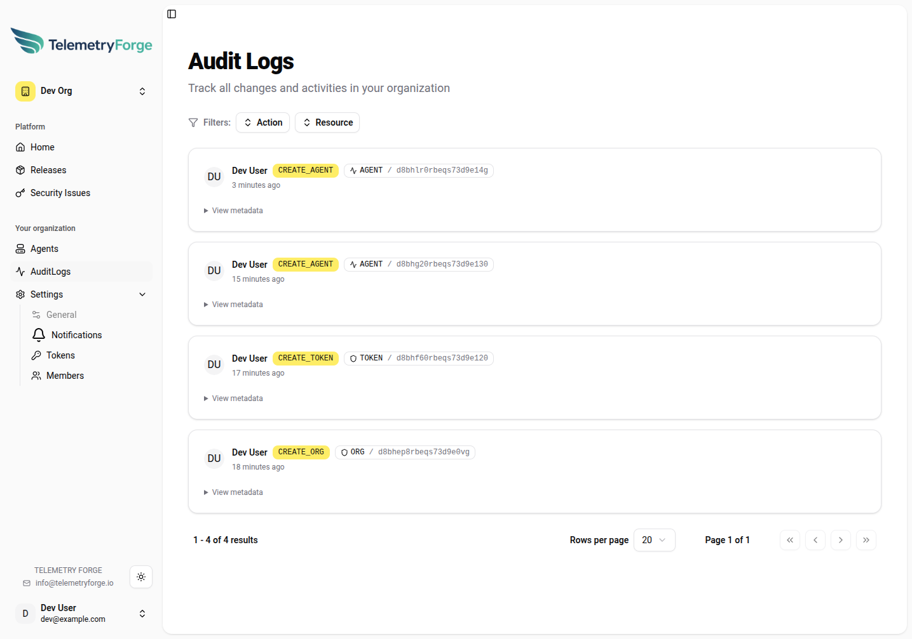
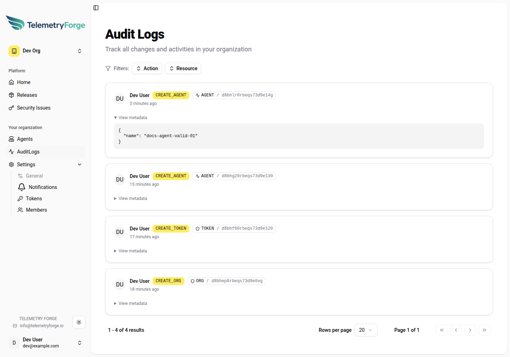

# Operations Guide

This guide focuses on the current UI workflow for adding and controlling agents.

## 1. Open Fleet Manager (Hosted)

Open Fleet Manager at:

- `https://manager.telemetryforge.io`

## 2. Login

1. Open the login page.
2. Use one of the default production login providers.



## 3. Create or Select an Organization

1. Use the org switcher in the left sidebar.
2. Create a new org (or select an existing one).
3. Open **Agents** under the selected org.

## 4. Add an Agent
1. In **Agents**, click **Add Agent**.
2. In the onboarding flow, click **Tokens**.
3. Click **Create Token**.
4. Create a token (scope is fixed to `REGISTER_AGENT` in this form).
5. Copy the token immediately. The secret is only shown once.
6. Use that token in your agent bootstrap process.







### API Registration Shortcut

You can create an agent directly via GraphQL using a `REGISTER_AGENT` token:

```bash
curl -sS https://manager.telemetryforge.io/graphql \
	-H 'Content-Type: application/json' \
	-H 'Authorization: <REGISTER_AGENT_TOKEN>' \
	--data '{
		"query":"mutation($in: CreateAgentInput!){createAgent(in:$in){id token createdAt}}",
		"variables":{
			"in":{
				"kind":"FLUENTBIT",
				"name":"docs-agent-01",
				"version":"3.1.2",
				"config":"{\"service\":{\"flush\":1,\"log_level\":\"info\"},\"pipeline\":{\"inputs\":[{\"name\":\"tail\",\"tag\":\"demo.logs\",\"path\":\"/var/log/*.log\",\"read_from_head\":true}],\"outputs\":[{\"name\":\"stdout\",\"match\":\"demo.logs\"}]}}",
				"os":"linux",
				"arch":"x86_64",
				"distro":"ubuntu",
				"packageType":"CONTAINER",
				"labels":{"env":"dev","site":"local"}
			}
		}
	}'
```

Note: this API expects the raw token value in the `Authorization` header (not `Bearer ...`).

## 5. Control Agents from the UI

Once agents appear in **Agents**, use these controls:

1. Filter by name and use column filters (status, version, OS, labels).
2. Click an agent name to open the detail page.
3. On the detail page, review:
	 - Status and last-seen timestamp.
	 - Version and platform metadata.
	 - Labels.
	 - Input/output throughput metrics.
	 - Rendered pipeline/config sections.
4. Use **Edit** in the labels section to update labels on a single agent.
5. Use **Delete** to remove an agent.



## 6. Bulk Control Multiple Agents

1. In **Agents**, check one or more rows.
2. Use **Apply Labels** to add labels to all selected agents.
3. Use **Remove** to remove selected agents.





## 7. Review Audit Logs

Use **AuditLogs** to track who changed what and when across your organisation.

1. Open **AuditLogs** in the left sidebar under your organisation.
2. Use the **Action** filter to narrow by operation type (for example `CREATE_AGENT`, `CREATE_TOKEN`, `UPDATE_AGENT`).
3. Use the **Resource** filter to focus on object type (`AGENT`, `TOKEN`, `ORG`, and others).
4. Review each entry for actor, action, target resource ID, and timestamp.
5. Expand **View metadata** on an entry to inspect the request details/payload.





Common usage patterns:

- Validate who created or removed agents during rollout windows.
- Confirm token creation/deletion events during access reviews.
- Correlate operational changes with telemetry or service regressions.

## 8. Operational Tips

- Keep labels consistent (`env`, `region`, `team`, `service`) so filtering and bulk actions stay predictable.
- Use agent detail pages during incident response to confirm status and last-seen timestamps quickly.
- Treat token creation as sensitive: create per environment, rotate regularly, and store secrets in a secure system.
