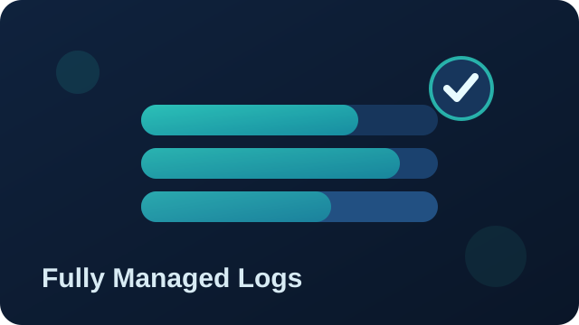

# Fully Managed Logs

{ .product-hero-image }

A complete, end-to-end observability platform built from best-of-breed open source components, customised specifically to your environment and needs with full security and customer isolation.

Two options of enterprise-grade setup, maintenance, monitoring and support for your entire log forwarding and aggregation stack:

* Hosted by Telemetry Forge
* Hosted by you with our support

Telemetry Forge provides direct assistance for all Fluent Bit agents, including open-source Fluent Bit and Telemetry Forge distributions.

* Logs infrastructure monitored 24 x 7.
* Backed by a service level agreement (SLA) on uptime, performance and compliance monitoring as required.
* Fully deployed, hardened and monitored by us.
* Tailored to your infrastructure: cloud-native, hybrid, edge, and fully on-prem.
* Full support for Kubernetes, bare metal, and all major cloud providers.

## Hosted by us

Fully managed log aggregation in our premises, the fastest path to an SLA-backed platform with zero operational overhead

* We deploy, scale and monitor a logs aggregation endpoint.
* Logs are forwarded from your premises through private link or virtual private cloud (VPC).
* Production lifecycle, hardening, upgrades, and 24x7 monitoring.
* (Optional) Hosted backend for scalable, long-term storage
* (Optional) Engineering hours for integration
* (Optional) Agent Licences

## Hosted on your infrastructure

Bring your own cloud (BYOC) mode although it will run on any hardware.

**You keep full control, we handle resilience and reliability.**

* We deploy in your infrastructure (Kubernetes, bare metal, or any cloud provider).
* Production lifecycle, hardening, upgrades and monitoring.
* Data reduction, redacting, filtering and complex routing performed by our team.
* SLA-backed for uptime, performance, and compliance.
* Included dedicated engineering hours.
* Included Agent licences.

