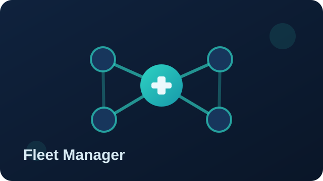
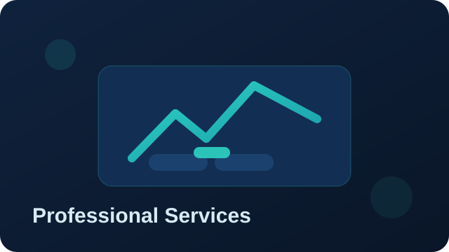

# Telemetry Forge Product Documentation

Telemetry Forge is a boutique observability consultancy who provides professional services and complete products for various customers or use cases.

We have deep expertise in Fluent Bit, telemetry pipelines and large-scale cloud native log infrastructure plus observability in general.

[Contact us](mailto:info@telemetryforge.io) for any of your observability needs.

Choose a product below to get started.

- 
	Our commercially supported LTS version of Fluent Bit with Enterprise features and security hardening.
- 
	Our hosted or on-premise fully managed stack to handle your logs.
- 
	Our hosted or on-premise solution that supports a full telemetry pipeline configuration and deployment with a built-in UI.
- 
	Custom engineering and observability consultancy for enterprise delivery.

## What we do

### Fully Managed Logs

Fully Managed services are designed for organisations that want Telemetry Forge to take full production responsibility for logging, including day-to-day operations, incident handling, upgrades, and continuous optimisation.

We can host and manage this for you or provide you everything required to deploy on your own infrastructure for full control.

Telemetry Forge provides direct assistance for all Fluent Bit agents, including open-source Fluent Bit and Telemetry Forge distributions.

* Logs infrastructure monitored 24 x 7.
* Backed by SLA on uptime, performance and compliance monitoring as required.
* Fully deployed, hardened and monitored by us.
* Tailored to your infrastructure: cloud-native, hybrid, edge, and fully on-prem.
* Full support for Kubernetes, bare metal, and all major cloud providers.

### Fleet Manager

Fleet Manager helps you manage large fleets of Fluent Bit agents from one place.

Use it to:

- Roll out configuration changes safely.
- Track agent health and connection status.
- Verify versions across environments.
- Standardise telemetry collection at scale.

Fleet Manager is available as a hosted service at <https://manager.telemetryforge.io> and can also be deployed on-premise.

Fleet Manager provides a central control plane so operators can define and roll out telemetry configuration consistently across environments.

### Telemetry Forge Agent

Enterprise-hardened, long-term supported variants of Fluent Bit: built and maintained by Telemetry Forge core engineering team.

Open source but commercially supported with SLAs, compliance and all the other requirements of Enterprise organisations.

### Professional Services & Support

* Observability configuration and deployment.
* Custom Engineering & Upstream Fluent Bit Development.
* Fluentd migration support.

